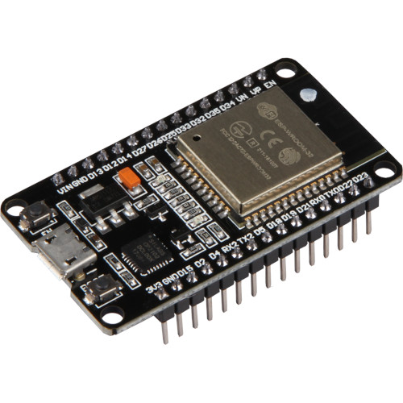

# DeSo Arduino Library

## Introduction
This is an unofficial personal arduino library to monitor the DeSo (Decentralized Social Network).

"DeSo is a new layer-1 blockchain built from the ground up to scale decentralized social applications to one billion users" [https://www.deso.org]

## Features
- Multiple DeSo Nodes supported for decentralization 
- DeSo Coin Value
- Creator Coin Price using username or PublicKey
- Wallet Balance (V0 API)
- All HODLE Asset balance
- Wallet Balance
- Top 10 Hodlers
- Last post like count
- Last post diamond count
- V1 API to get balance
- Global Recent posts feed
- Actual hodle asset sum 

Note: Top 10 Hodlers (Recommand Top 5 in case memory issue)

## Serial Output Results
```
DeSo Node: https://bitclout.com
Node Status: Synced OK
DeSo Coin Value: $121.90
=======Profile========
Username: ropolexi
PublicKey: BC1YLfghVqEg2igrpA36eS87pPEGiZ65iXYb8BosKGGHz7JWNF3s2H8
Creator Coin Price: $31.68
Wallet Balance: $1.02
Total HODLE assets : 4
Total HODLE Asset Balance: $35.40
======================

DeSo Node: https://nachoaverage.com
Node Status: Synced OK
DeSo Coin Value: $121.90
=======Profile========
Username: ropolexi
PublicKey: BC1YLfghVqEg2igrpA36eS87pPEGiZ65iXYb8BosKGGHz7JWNF3s2H8
Creator Coin Price: $31.68
Wallet Balance: $1.02
Total HODLE assets : 4
Total HODLE Asset Balance: $35.40
======================

DeSo Node: https://members.giftclout.com
Node Status: Synced OK
DeSo Coin Value: $121.90
=======Profile========
Username: ropolexi
PublicKey: BC1YLfghVqEg2igrpA36eS87pPEGiZ65iXYb8BosKGGHz7JWNF3s2H8
Creator Coin Price: $31.68
Wallet Balance: $1.02
Total HODLE assets : 4
Total HODLE Asset Balance: $35.40
======================
```
## Device Supported



ESP32 Module


## Functions
- char *genLocaltime(time_t ts);
- void addNodePath(const char *url, const char *cert);
- int getMaxNodes();
- void selectDefaultNode(int index);
- char *getSelectedNodeUrl();
- bool getSelectedNodeStatus();
- const char *getRequest(const char *apiPath);
- const char *postRequest(const char *apiPath, const char *data);
- const char *getNodeHealthCheck();
- int updateNodeHealthCheck();
- const char *getExchangeRates();
- int updateExchangeRates();
- const char *getSingleProfile(const char *messagePayload);
- int updateSingleProfile(const char *username, const char *PublicKeyBase58Check, Profile *prof);
- const char *getUsersStateless(const char *messagePayload);
- const char *getHodlersForPublicKey(const char *messagePayload);
- int updateHodlersForPublicKey(const char *username, const char *PublicKeyBase58Check, int NumToFetch, Profile *prof);
- void clearTopHodlersUserNames(Profile *prof);
- const char *getSinglePost(const char *messagePayload);
- int updateSinglePost(const char *postHashHex, bool fetchParents, int commentOffset, int commentLimit, const char *readerPublicKeyBase58Check,bool addGlobalFeedBool, Post *post);
- const char *getPostsForPublicKey(const char *messagePayload);
- int updateLastNumPostsForPublicKey(const char *PublicKeysBase58Check, int NumToFetch, Profile *prof);
- const char *getUserBalance(const char *messagePayload);
- int updateUsersBalance(const char *PublicKeysBase58Check, Profile *prof);
- const char *getPostsStateless(const char *messagePayload);
- int updatePostsStateless(const char *postHashHex, const char *readerPublicKeyBase58Check, int numToFetch, bool getPostsForGlobalWhitelist, long timePeriod);
- HTTPClient *updateHodlersForPublicKey(const char *PublicKeyBase58Check,
                                          const char *Username, const char *LastPublicKeyBase58Check, int NumToFetch,
                                          bool IsDAOCoin, bool FetchHodlings, const char *SortType, bool FetchAll, Profile *prof);
- int updateHodleAssetBalance(const char *username, const char *PublicKeyBase58Check, Profile *prof);
- int updateTopHolders(const char *username, const char *PublicKeyBase58Check, int NumToFetch, Profile *prof);
- HTTPClient *postRequestNew(const char *apiPath, const char *data);
   
## Changes
- (2021-10-1) support old and new api changes due to rebranding.
- (2022-12-3) 
  - calculate actual hodle assets value using bonding curve equation
  - avoid using updateUsersStateless due to high memory demand for that api when SkipHodlings is false
  - use getUserBalance to get wallet balance and updateHodleAssetBalance to get hodle assets actual value
- (2022-12-4) Hodling asset balance for all the assets by retrieving 10 assets at a time to avoid memory overflow
- (2022-12-5) wallet balance json decode using json-streaming-parser to avoid long list of UTXOs (unpend transactions). Now faster decoding for wallet balance.
- (2023-1-30) Updated functions updateTopHolders, updateHodleAssetBalance and updateLastNumPostsForPublicKey to support large json data 
## Dependency Libraries
ArduinoJson - https://github.com/bblanchon/ArduinoJson
json-streaming-parser - https://github.com/squix78/json-streaming-parser


**DeSoLibraryESP32 library does not need any seed phrase to access any account. This library is for monitoring purposes only**