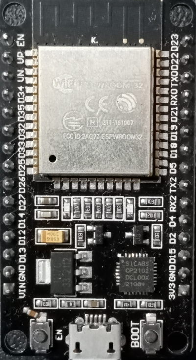
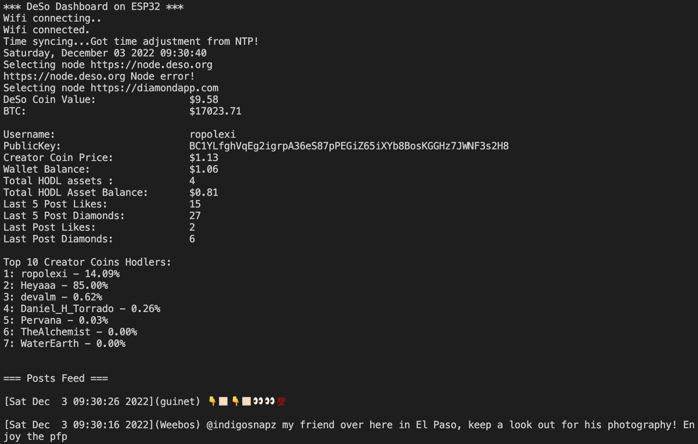

# DeSo Post Feed

## Introduction
This is to demostrate the use of deso library to display deso user information with esp32 microcontroller 

## Pre requisite libraries
- https://github.com/bblanchon/ArduinoJson
- https://github.com/ropolexi/DeSo-Arduino-Lib

## Components
### ESP32 (devkit v1)



## Settings

Wifi settings and timezone data need to be entered in order to this example to work

```
// Fill in timezone in seconds
const long gmtOffset_sec = 19800; //+5:30
const int daylightOffset_sec = 0;
// Fill in the username
const char username[] = "ropolexi";
// Fill in the ssid and password
const char ssid[] = "";
const char wifi_pass[] = "";
```

## To change posts feed output format

https://github.com/ropolexi/DeSo-Arduino-Lib/blob/master/DeSoLib.cpp#L446
```
Serial.printf("\n[%s](%s) %s\n",genLocaltime(ts),username.c_str(),body.c_str());
```
## Serial output


