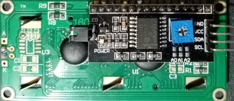
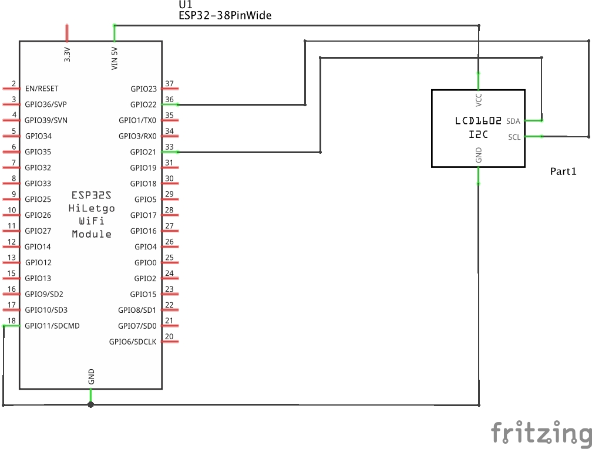
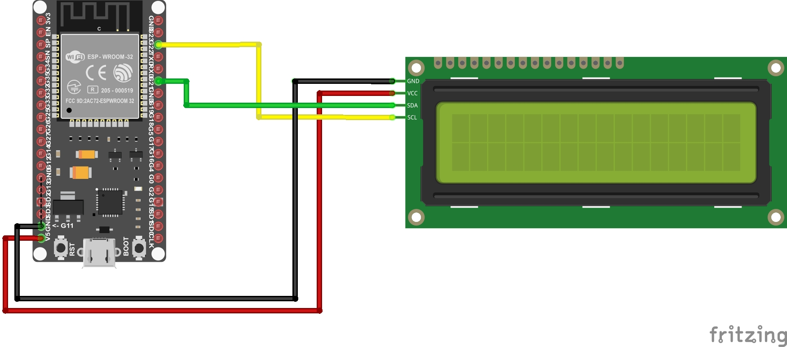
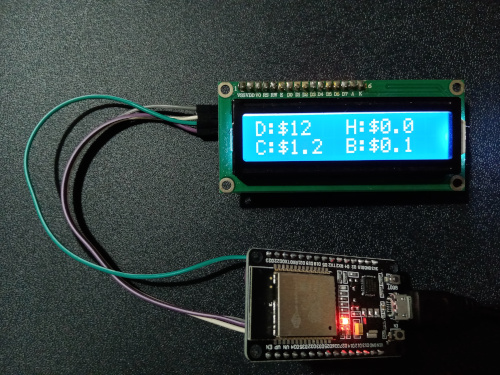
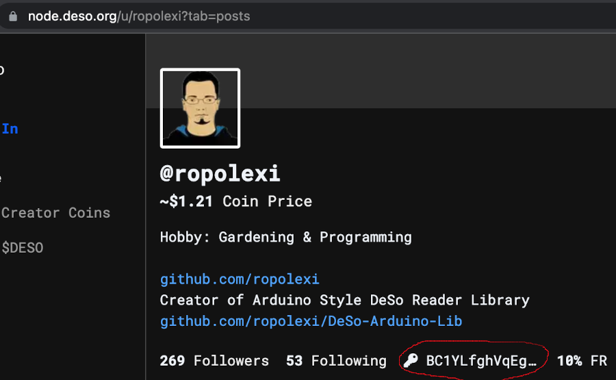
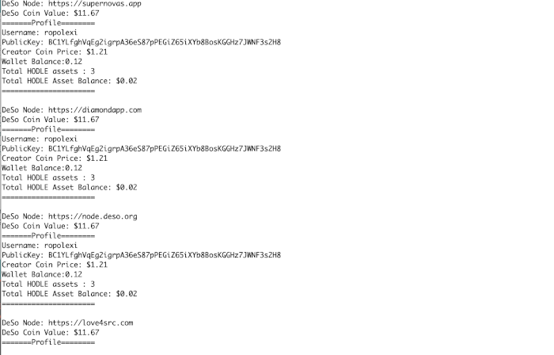

# DeSo Dashboard with 16x2 LCD

## Introduction
This is to demostrate the use of deso library to display information about a user on a 16x2 lcd screen with esp32 microcontroller 

## Pre requisite libraries
- https://github.com/bblanchon/ArduinoJson
- https://github.com/johnrickman/LiquidCrystal_I2C
- https://github.com/ropolexi/DeSo-Arduino-Lib

## Components
### ESP32 (devkit v1)


### LCD 16x2



## Schematic Diagram


## Circuit wiring Diagram


## Prototype



D: DeSo Coin price

C: Creator coin price

H: User hodle value

B: User wallet balance

User account can be edited in userPublicKey variable in the code
```
const char userPublicKey[] ="BC1YLfghVqEg2igrpA36eS87pPEGiZ65iXYb8BosKGGHz7JWNF3s2H8";
```

Public key can be found out by going to https://node.deso.org/ and user profile



DeSo nodes added in this example, this can be edited according to the current working nodes
```
  deso.addNodePath("https://node.deso.org", "");
  deso.addNodePath("https://love4src.com","");
  deso.addNodePath("https://desocialworld.com","");
  deso.addNodePath("https://supernovas.app","");
  deso.addNodePath("https://diamondapp.com","");
  ```

## Serial output


