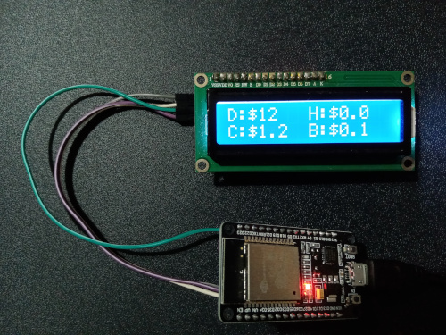

# DeSo Dashboard with 16x4 LCD

## Introduction
This is to demonstrate the use of deso library to display information about a user on a 16x4 lcd screen with esp32 microcontroller 

Displays deso price, balance, hodling asset balance, CC price, latest posts likes and diamond counts, and top 3 CC holders.

Updates every 1 min from a deso node, lcd screen changes every 5 seconds to show top holders and profile details in a loop.


## Pre requisite libraries
- https://github.com/bblanchon/ArduinoJson
- https://github.com/johnrickman/LiquidCrystal_I2C
- https://github.com/ropolexi/DeSo-Arduino-Lib
- https://github.com/squix78/json-streaming-parser

## Components
### ESP32 (devkit v1)


## Settings
```
// Fill in the ssid and password
const char ssid[] = "";
const char wifi_pass[] = "";
const char *username = "ropolexi";
```


## Schematic Diagram


## Circuit wiring Diagram


## Prototype



D: DeSo Coin price

C: Creator coin price

H: User hodle value

B: User wallet balance


